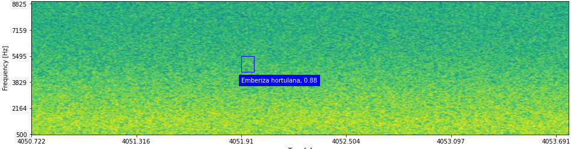

# NBM: an Open Dataset for the Acoustic Monitoring of Nocturnal Migratory Birds in Europe ([Link to paper](https://arxiv.org/pdf/2412.03633)).



### NBM dataset on Zenodo

The NBM dataset can be found and downloaded at this address: (https://zenodo.org/records/15655748).

### NBM object detection model

#### 🐥 Installation
- Install python version 3.10
- Create virtual environment with conda (or venv) and activate it.
Here is how to do with conda.

```
conda create venv
conda activate venv
pip install -r requirements.txt
```

#### 🐔 Model weights
The `model_weights` directory includes both the checkpoints and the configuration file.

#### 🦉 Prerequisite
To run the model you will need the checkpoint and config files, along with the dictionnary file (bird_dict.json) linking species names to ids.

#### 🐦 Model execution 

Execute the following command line instruction to analyze all `.wav` files in a directory:

`python nbm_model/nbm_detect.py --ckpt model_weights --audio_dir <PATH_TO_WAV_FILES_DIRECTORY>`

The NBM object detection model currently classifies (fligt) calls from common European songbird species. Please refer to the paper for an exhaustive list of the main species. 
A number of species lacking substantial training data can still be identified but with reduced accuracy.


